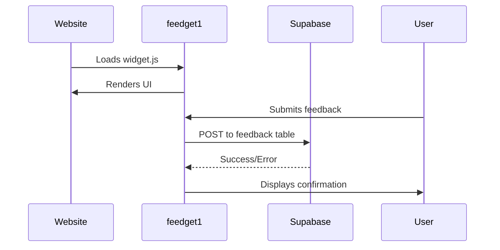

# feedget1

`feedget1` is a privacy-focused, self-hosted feedback collection widget that you can easily embed on any website. It stores responses directly in your Supabase database (BYOS model), requires zero backend code, and fully conforms to WCAG 2.1 AA accessibility standards.

---

## 1. Core Concept

* **Privacy-focused**: All data lives in your own Supabase instance.
* **Zero backend code**: Embed with a single `<script>` tag.
* **Fully customizable**: Configure via `data-*` attributes or JavaScript.
* **Accessible**: Meets WCAG 2.1 AA (keyboard navigation, ARIA, contrast).

---

## 2. Technical Specifications

### Frontend

* **Compatibility**: Any site (React, Vue, plain HTML)
* **Dependencies**: None (vanilla JS)
* **Bundle size**: \~15 kB gzipped
* **Browsers supported**: Chrome, Firefox, Safari, Edge (latest 2 versions)

### Backend

* **Supabase project** (PostgreSQL ≥ 14)
* **Row Level Security** enabled
* **Anon key** with `INSERT` permission only

---

## 3. Data Flow Architecture



---

## 4. Database Schema

```sql
CREATE TABLE public.feedback (
  id UUID PRIMARY KEY DEFAULT gen_random_uuid(),
  feedback TEXT NOT NULL,         -- Main feedback text
  email TEXT,                     -- Optional email
  page_url TEXT,                  -- URL where submitted
  user_agent TEXT,                -- Browser/device info
  custom_fields JSONB,            -- Custom Q&A data
  created_at TIMESTAMPTZ DEFAULT NOW()  -- Timestamp
);

-- Enable row-level security:
ALTER TABLE public.feedback ENABLE ROW LEVEL SECURITY;

-- Allow anonymous inserts:
CREATE POLICY "Allow anonymous inserts"
  ON public.feedback
  FOR INSERT
  TO anon
  USING (true);
```

---

## 5. Installation
Basic HTML Implementation

Add this code before closing </body> tag:
html
```javascript
<!-- Required CSS -->
<link rel="stylesheet" href="path/to/widget.css">

<!-- Widget script -->
<script src="path/to/widget.js" 
  data-supabase-url="https://your-project.supabase.co"
  data-supabase-key="your-anon-key"
  data-title="Feedback"
  data-theme="light"
></script>
```
### Important Notes:

*    No NPM package - The widget is designed for direct JavaScript inclusion

*    No build step required - Works with plain HTML/JS

*    Self-hosted files - You need to manually place the JS/CSS files in your project

*    Configuration options:

        Must provide: data-supabase-url and data-supabase-key

        Optional: data-title, data-theme, data-position etc.

---

## 6. Configuration Reference

| Parameter     | Type     | Default    | Description                                |
| ------------- | -------- | ---------- | ------------------------------------------ |
| `supabaseUrl` | `string` | *required* | Supabase project URL                       |
| `supabaseKey` | `string` | *required* | Supabase anon key                          |
| `theme`       | `enum`   | `auto`     | `light`<br>`dark`<br>`auto`                |
| `position`    | `enum`   | `br`       | `tl`, `tr`, `bl`, `br` (corners)           |
| `storage`     | `enum`   | `session`  | `local`, `session` (draft storage)         |
| `questions`   | `array`  | `[]`       | Custom question objects (see schema below) |

### Question Object Schema

```typescript
{
  type: 'text' | 'email' | 'select' | 'number',
  name: string,            // Field ID (maps to DB column)
  label: string,           // Display label
  required?: boolean,      // Default: false
  placeholder?: string,    // Input placeholder
  options?: string[],      // For select only
  pattern?: string         // Regex validation
}
```

---

## 7. Styling Customization

Override CSS variables in your own stylesheet:

```css
:root {
  --fg-primary: #4f46e5;     /* Brand color */
  --fg-font: 'Inter', sans-serif;
  --fg-border-radius: 12px;
  --fg-shadow: 0 4px 20px rgba(0,0,0,0.15);
}

/* Dark mode override */
@media (prefers-color-scheme: dark) {
  :root {
    --fg-primary: #818cf8;
  }
}
```

---

## 8. Security Considerations

* Always **enable RLS** before production use.
* Restrict anon key to **INSERT** only.
* Set **CORS origins** in Supabase to your domain.

---
